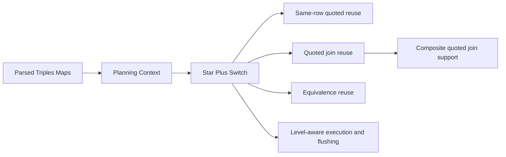

# SDM-RDFizer Star Plus Unified

Lean working tree for the `SDM-RDFizer Star Plus` runtime.

This repo is intentionally scoped to:

- engine code
- one small runnable reference scenario
- a short project README
- an optional thesis PDF slot for writing/reference work later

## What This Work Adds



In practice, the current unified runtime focuses on making quoted-triples execution cheaper without changing the mapping language:

- exact-row reuse for repeated same-source quoted materialization
- join-keyed reuse for cross-source quoted access
- conservative equivalence reuse for isolated support triples maps
- one master `enable_sdm_rdfizer_star_plus` switch
- eager join prebuild left opt-in
- composite-key support for quoted joins as well as parent-triples-map joins

## Repo Shape

```text
rdfizer_star/                  Core engine implementation
run_rdfizer.py                 Main entrypoint
requirements.txt               Python dependencies
scenarios/composite_quoted_probe/
  config.ini                   Small reference config
  mapping.ttl                  Composite quoted join mapping
  ratings.csv                  Producer source
  annotations.csv              Consumer source
docs/thesis/master_thesis.pdf  Reserved slot for the thesis PDF
```

## Run The Reference Scenario

```powershell
python run_rdfizer.py scenarios\composite_quoted_probe\config.ini
```

The scenario is intentionally small and exercises quoted composite joins across sources.

## Config Surface

Use the unified runtime through:

```ini
enable_sdm_rdfizer_star_plus: yes
enable_eager_join_prebuild: no
```

`enable_sdm_rdfizer_star_plus` turns on the Star Plus runtime path. `enable_eager_join_prebuild` stays optional and defaults to off.

## Thesis Slot

The thesis PDF now lives at:

```text
docs/thesis/master_thesis.pdf
```

Reference file:

- [SDM-RDFizer Star Plus Thesis](docs/thesis/master_thesis.pdf)

I can use that as the primary writing and reference anchor for further cleanup, wording, and thesis-aligned documentation work.
