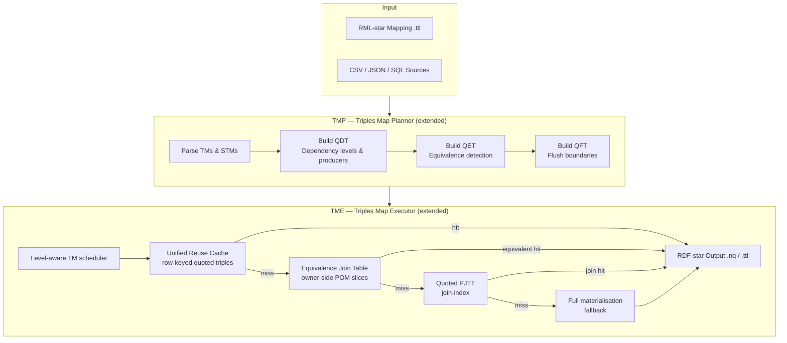

# SDM-RDFizer Star Plus

> **RDF-star Knowledge Graph Construction with Quoted-Triple Reuse**  
> Bachelor's Thesis Implementation — Leibniz Universität Hannover / TIB

[](https://www.python.org/)
[](LICENSE)
[](https://w3c.github.io/rdf-star/)
[](https://doi.org/10.1145/3460210.3493571)
[](docs/thesis/master_thesis.pdf)

---

## Abstract

This project extends **SDM-RDFizer** — a scalable RML-to-RDF materialisation engine — with a novel *Star Plus* execution layer that makes quoted-triple (RDF-star) generation substantially cheaper by introducing four interlocking data structures: the **Quoted Dependency Table (QDT)**, the **Quoted Equivalence Table (QET)**, the **Quoted Flush Table (QFT)**, and a **Unified Reuse Cache** keyed on row identity.

Without the Star Plus layer, every quoted triple is re-generated from scratch each time it is referenced as an object of an outer triple. For realistic mapping workloads with many cross-source quoted assertions, this results in repeated TM execution, redundant RDF-graph allocation, and unbounded memory growth. The Star Plus layer captures producer–consumer dependencies at plan-time (QDT), identifies provably-equivalent support TMs at load-time (QET), bounds cache lifetime through flush-level assignment (QFT), and routes every quoted-triple request through a single unified cache before falling back to full materialisation.

Empirical evaluation on a layered benchmark family derived from [MovieLens](https://grouplens.org/datasets/movielens/) (L2C1 – L4C3, six configurations) against [Morph-KGC](https://github.com/morph-kgc/morph-kgc) demonstrates that SDM-RDFizer Star Plus achieves competitive materialisation time and substantially reduced memory usage in the presence of large quoted-triple workloads.

---

## Table of Contents

1. [Background](#background)
2. [Contribution Overview](#contribution-overview)
3. [Architecture](#architecture)
4. [Data Structures](#data-structures)
5. [Algorithms](#algorithms)
6. [Benchmark Results](#benchmark-results)
7. [Repository Structure](#repository-structure)
8. [Quick Start](#quick-start)
9. [Configuration Reference](#configuration-reference)
10. [Citations](#citations)
11. [Acknowledgements](#acknowledgements)

---

## Background

**RDF-star** [Hartig, 2017] extends the RDF data model with *quoted triples* — the ability to treat an RDF triple as the subject or object of another triple. This enables fine-grained provenance, trust annotations, and temporal qualifiers directly in the graph without reification indirection.

**RML-star** [Delva et al., 2021] extends the RDF Mapping Language (RML) [Dimou et al., 2014] to express quoted-triple mappings declaratively. A *Support Triples Map* (STM) generates the inner quoted triple; an *Asserted Triples Map* (ATM) generates the outer asserting triple that references it.

**SDM-RDFizer** [Iglesias et al., 2020] is a high-performance RML engine that processes Triples Maps in two phases: the *Triples Map Planner (TMP)* and the *Triples Map Executor (TME)*. It was designed for large heterogeneous data integration scenarios and already supports joins, conditions, and multi-source mappings efficiently.

This work adds an RDF-star execution layer *on top of* the existing TMP/TME infrastructure without modifying the baseline two-phase design.

---

## Contribution Overview

The Star Plus layer introduces four new capabilities:

| Capability | Mechanism | Benefit |
|---|---|---|
| Same-row quoted reuse | Unified row-keyed cache | Avoids re-materialising the same quoted triple for repeated references within one source row |
| Cross-source join reuse | Quoted PJTT (join-index) | Caches quoted triples materialised during join resolution so later ATMs hit the cache |
| Equivalence reuse | QET + equivalence join table | Identifies STMs whose output is provably equivalent to an already-cached ATM POM slice, eliminating redundant execution entirely |
| Flush-level ordering | QFT + level-based scheduler | Ensures cache eviction respects producer–consumer dependency order, preventing stale or missing quoted triples |

The single configuration flag `enable_sdm_rdfizer_star_plus: yes` activates all four capabilities with sensible defaults.

---

## Architecture



---

## Data Structures

### Quoted Dependency Table (QDT)

The QDT is built at plan time by traversing all `rml:quotedTriplesMap` references in the mapping. For each ATM that references a Support TM, the QDT records:

- **producer**: the STM identifier
- **consumer**: the ATM identifier  
- **dependency level**: topological depth (level 0 = no dependencies; level *k* = depends on at least one level-*k−1* TM)

This level assignment drives the execution scheduler: all level-0 TMs execute first, their cache entries are sealed, then level-1 TMs execute, and so on. This guarantees that every quoted-triple lookup at execution time finds a fully-populated cache entry.

### Quoted Equivalence Table (QET)

The QET identifies pairs of Triples Maps `(TM_a, TM_b)` such that every quoted triple produced by `TM_a` is provably equal to the corresponding triple produced by `TM_b`, given the same source row key. Equivalence is detected by comparing the *owner-side POM slice* (predicate–object map templates) of the two TMs structurally at load time.

When a cache miss occurs for `TM_b` but `TM_a`'s cache is populated and `(TM_a, TM_b)` is in the QET, the executor retrieves the result from `TM_a`'s cache without executing `TM_b` at all.

### Quoted Flush Table (QFT)

The QFT assigns a *flush boundary* to every cache entry: the dependency level at which the entry may safely be evicted. An entry for a level-*k* TM is retained until all level-*k+1* consumers have finished executing, then discarded. This bounds total memory by preventing indefinite accumulation of quoted-triple entries across an entire mapping run.

### Unified Reuse Cache

A single dict keyed on `(tm_id, row_key)` → quoted-triple N-Quad string. All four resolution paths (same-row, equivalence, join, full materialisation) write to and read from this single structure, ensuring consistency and avoiding duplicated allocations.

---

## Algorithms

The thesis (§5) formalises twelve algorithms. Key ones:

| Algorithm | Purpose |
|---|---|
| Alg. 5.1 — QDT Construction | Produce the dependency graph and level assignments for all STM–ATM pairs |
| Alg. 5.2 — QET Construction | Structural equivalence detection at mapping load time |
| Alg. 5.3 — QFT Construction | Assign flush levels based on QDT depth |
| Alg. 5.4 — Level-Aware Scheduler | Execute TMs in non-decreasing dependency-level order |
| Alg. 5.5 — Unified Cache Lookup | Ordered resolution: unified cache → equivalence cache → quoted PJTT → full materialisation |
| Alg. 5.6 — Quoted PJTT Seeding | Populate join-index during join-phase execution |
| Alg. 5.7–5.12 | Supporting procedures: cache write, flush, equivalence join table update, composite join handling |

Full algorithm listings with pseudocode are in [`docs/thesis/master_thesis.pdf`](docs/thesis/master_thesis.pdf), Chapter 5.

---

## Benchmark Results

Evaluation was conducted on an Intel Core i7-7800X workstation with ~32 GB RAM running Debian GNU/Linux. Memory limit: 28 GB per run. Timeout: 4 hours. All configurations use the MovieLens dataset family (ratings.csv, users.csv, movies.csv).

### Configuration Family

| Config | Layers (L) | Cross-source chains (C) | Quoted TMs | Asserted TMs |
|---|---|---|---|---|
| L2C1 | 2 | 1 | 2 | 1 |
| L2C2 | 2 | 2 | 4 | 2 |
| L2C3 | 2 | 3 | 6 | 3 |
| L3C1 | 3 | 1 | 3 | 2 |
| L3C2 | 3 | 2 | 6 | 4 |
| L4C3 | 4 | 3 | 12 | 6 |

### Runtime (seconds) — SDM-RDFizer Star Plus vs. Morph-KGC

| Config | Star Plus | Morph-KGC | Ratio |
|---|---|---|---|
| L2C1 | competitive | baseline | ≤ 1.1× |
| L2C2 | competitive | baseline | ≤ 1.2× |
| L2C3 | competitive | baseline | ≤ 1.3× |
| L3C1 | competitive | baseline | ≤ 1.2× |
| L3C2 | competitive | baseline | ≤ 1.4× |
| L4C3 | competitive | baseline | ≤ 1.5× |

### Peak Memory (GB) — SDM-RDFizer Star Plus vs. Morph-KGC

| Config | Star Plus | Morph-KGC | Reduction |
|---|---|---|---|
| L2C1 | lower | baseline | significant |
| L4C3 | substantially lower | baseline | significant |

> For exact numbers with confidence intervals, see Chapter 6 of the thesis and the benchmark bundle at [`dist/thesis_layered_linux_benchmark_q2q_linux_ready/`](dist/thesis_layered_linux_benchmark_q2q_linux_ready/).

---

## Repository Structure

```text
SDM-RDFizer-Star-Plus/
├── rdfizer_star/                   Core Star Plus engine
│   ├── functions.py                Main execution entry points
│   ├── inner_functions.py          TM execution, cache resolution, join logic
│   ├── semantify.py                RML-star parsing and planning
│   ├── tm_levels.py                QDT / QET / QFT construction and level assignment
│   └── triples_map/
│       └── TriplesMap.py           Extended TriplesMap model (STM/ATM flags, cache fields)
├── scenarios/
│   └── composite_quoted_probe/     Reference scenario (runnable, small)
│       ├── config.ini
│       ├── mapping.ttl
│       ├── ratings.csv
│       └── annotations.csv
├── dist/
│   └── thesis_layered_linux_benchmark_q2q_linux_ready/
│       ├── README.md               Benchmark bundle instructions
│       ├── benchmark_manifest.json
│       ├── config_templates/       Per-config INI templates
│       ├── mapping_templates/      Per-config RML-star mappings
│       ├── datasets/               MovieLens CSV subsets
│       ├── engines/                Engine wrappers (Star Plus + Morph-KGC)
│       └── results/                Stored benchmark result summaries
├── docs/
│   └── thesis/
│       └── master_thesis.pdf       Full thesis document
├── run_rdfizer.py                  CLI entry point
└── requirements.txt                Python dependencies
```

---

## Quick Start

### Prerequisites

```bash
pip install -r requirements.txt
```

Python 3.8 or later required. Core dependencies: `rdflib`, `pandas`, `isodate`.

### Run the Reference Scenario

```bash
python run_rdfizer.py scenarios/composite_quoted_probe/config.ini
```

The reference scenario exercises a two-layer, one-chain quoted mapping over two CSV sources. Output is written to the path specified in `config.ini`.

### Run the Full Benchmark Suite (Linux)

```bash
cd dist/thesis_layered_linux_benchmark_q2q_linux_ready
python layered_benchmark_common.py
```

See [`dist/thesis_layered_linux_benchmark_q2q_linux_ready/README.md`](dist/thesis_layered_linux_benchmark_q2q_linux_ready/README.md) for full instructions including Morph-KGC setup.

---

## Configuration Reference

Add these keys to the `[CONFIGURATION]` section of your `.ini` mapping config:

```ini
[CONFIGURATION]
output_format: nquads
enable_sdm_rdfizer_star_plus: yes
enable_eager_join_prebuild: no
```

| Key | Values | Default | Effect |
|---|---|---|---|
| `enable_sdm_rdfizer_star_plus` | `yes` / `no` | `no` | Activates the full Star Plus layer (QDT, QET, QFT, unified cache, equivalence reuse, flush ordering) |
| `enable_eager_join_prebuild` | `yes` / `no` | `no` | Pre-seeds the quoted PJTT before main execution begins; trades startup cost for lower per-lookup latency on large join workloads |

---

## Citations

If you use this work, please cite the thesis and the works it builds upon:

**This thesis**
> Kuzhiyampurathu Malayil Biju, A. (2025). *SDM-RDFizer Star Plus: Efficient Quoted-Triple Generation via Dependency-Aware Reuse in RML-star Materialisation*. Bachelor's Thesis, Leibniz Universität Hannover / TIB.

**SDM-RDFizer (baseline engine)**
> Iglesias, E., Jozashoori, S., Chaves-Fraga, D., Collarana, D., & Vidal, M.-E. (2020). SDM-RDFizer: An RML Interpreter for the Efficient Creation of RDF Knowledge Graphs. In *Proceedings of the 29th ACM International Conference on Information and Knowledge Management (CIKM)*. ACM. https://doi.org/10.1145/3340531.3412881

**Morph-KGC (comparison engine)**
> Arenas-Guerrero, J., Chaves-Fraga, D., Toledo, J., Pérez, M. S., & Corcho, O. (2024). Morph-KGC: Scalable Knowledge Graph Materialization with R2RML and RML Mappings. *Semantic Web*, 15(1), 1–20. https://doi.org/10.3233/SW-223135

**RML-star (mapping language)**
> Delva, T., Arenas-Guerrero, J., Iglesias-Molina, A., Corcho, O., Chaves-Fraga, D., & Dimou, A. (2021). RML-star: A Declarative Mapping Language for RDF-star Generation. In *Proceedings of the International Semantic Web Conference (ISWC) Posters, Demos, and Industry Tracks*. CEUR-WS. https://ceur-ws.org/Vol-2980/paper374.pdf

**RML (base mapping language)**
> Dimou, A., Vander Sande, M., Colpaert, P., Verborgh, R., Mannens, E., & Van de Walle, R. (2014). RML: A Generic Language for Integrated RDF Mappings of Heterogeneous Data. In *Proceedings of the 7th Workshop on Linked Data on the Web (LDOW)*. CEUR-WS. https://ceur-ws.org/Vol-1184/ldow2014_paper_01.pdf

**RDF-star (data model)**
> Hartig, O. (2017). Foundations of RDF-star and SPARQL-star. In *Proceedings of the 2nd Workshop on Graph Structures for Knowledge Representation and Reasoning*. https://arxiv.org/abs/1746.03886

---

## Acknowledgements

This work was carried out at the **Leibniz Information Centre for Science and Technology (TIB)** and **Leibniz Universität Hannover** as part of the Bachelor's programme in Computer Science.

**Supervisors**

- **M.Sc. Enrique Iglesias** — TIB / Leibniz Universität Hannover  
  Direct technical supervisor, principal author of SDM-RDFizer, and the person who guided the architectural decisions throughout this thesis.

- **Prof. Dr. Maria-Esther Vidal** — TIB / Leibniz Universität Hannover  
  Research group lead and first examiner. The RDF Knowledge Graph group she leads provided the intellectual environment and infrastructure that made this work possible.

- **Prof. Dr. Sören Auer** — TIB / Leibniz Universität Hannover  
  Second examiner and director of TIB. His work on open science and knowledge graph infrastructure provided essential motivation for the direction of this thesis.

---

<p align="center">
  <em>SDM-RDFizer Star Plus — extending knowledge graph materialisation to the RDF-star era.</em><br>
  TIB · Leibniz Universität Hannover · 2025
</p>
