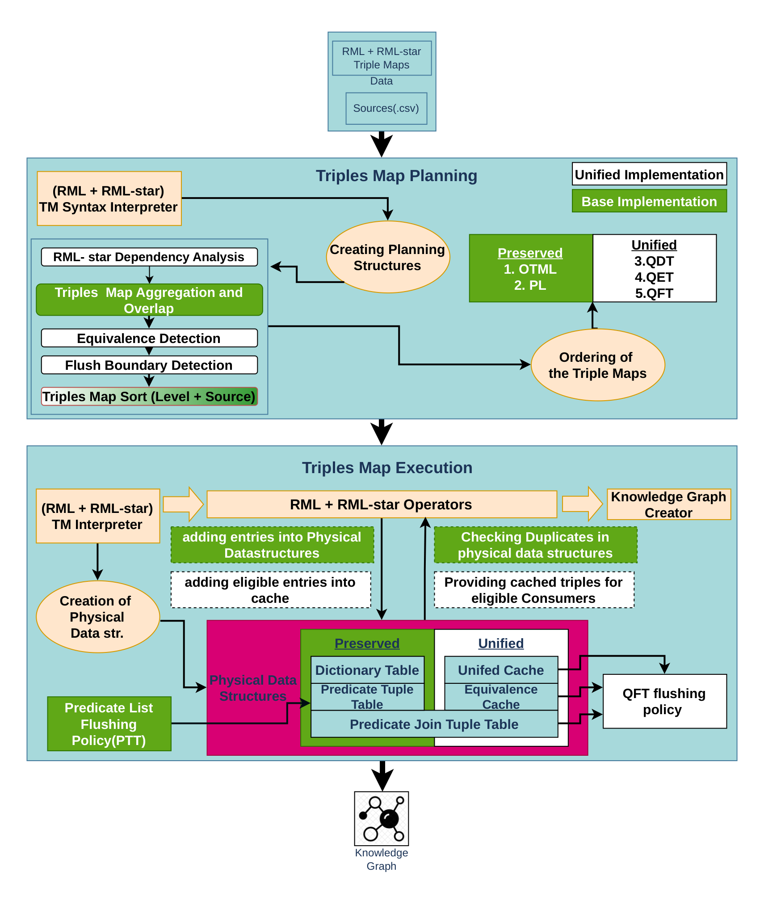

# SDM-RDFizer Star Plus

An extension of [SDM-RDFizer](https://github.com/SDM-TIB/SDM-RDFizer) that makes quoted-triple (RDF-star) generation efficient through dependency-aware reuse.

The engine accepts RML-star mappings over heterogeneous CSV sources and produces an RDF-star knowledge graph. On top of the preserved two-phase planning and execution pipeline, the Star Plus layer introduces three new planning structures — the **Quoted Dependency Table (QDT)**, **Quoted Equivalence Table (QET)**, and **Quoted Flush Table (QFT)** — and a unified execution layer with a row-keyed cache, an equivalence cache, and a quoted predicate join tuple table. Together these eliminate redundant re-materialisation of quoted triples, bound cache lifetime through flush-level ordering, and route every quoted-triple request through a single resolution path before falling back to full materialisation.

The single flag `enable_sdm_rdfizer_star_plus: yes` in the mapping config activates the full layer.

## Architecture



Full design, algorithms, and evaluation are documented in the thesis:  
[`docs/thesis/master_thesis.pdf`](docs/thesis/master_thesis.pdf)

## Quick Start

```bash
pip install -r requirements.txt
python run_rdfizer.py scenarios/composite_quoted_probe/config.ini
```

## Configuration

```ini
[CONFIGURATION]
output_format: nquads
enable_sdm_rdfizer_star_plus: yes
enable_eager_join_prebuild: no
```

| Key | Values | Default |
|---|---|---|
| `enable_sdm_rdfizer_star_plus` | `yes` / `no` | `no` |
| `enable_eager_join_prebuild` | `yes` / `no` | `no` |

## Repository Structure

```
rdfizer_star/          Core engine
run_rdfizer.py         Entry point
requirements.txt       Dependencies
docs/
  architecture.png     System architecture diagram
  thesis/
    master_thesis.pdf  Full thesis
dist/                  Benchmark bundle (Linux)
```
